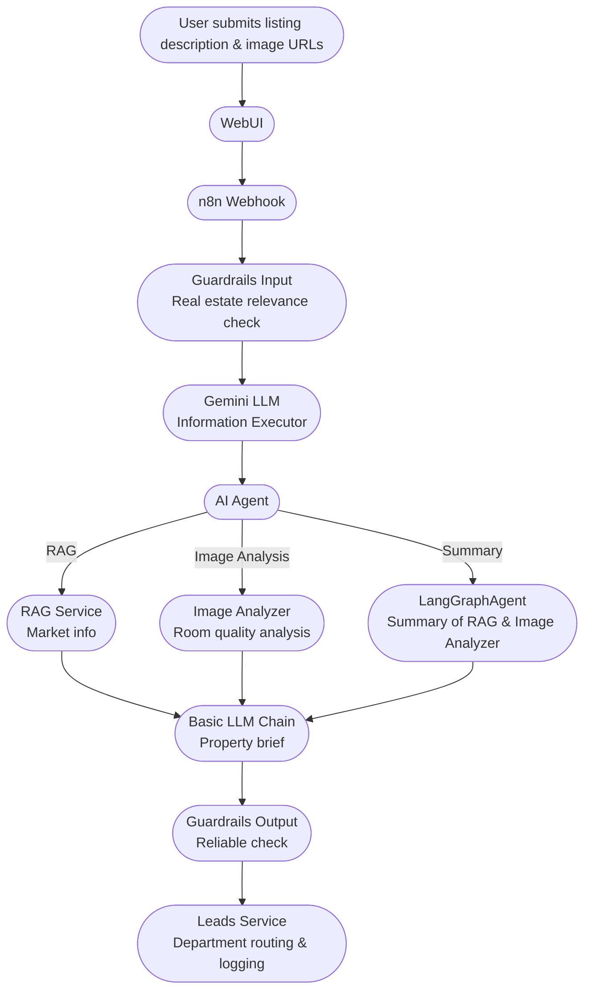

# Architecture Diagram and Design Decisions

Below is the architecture diagram for aiPropertyTriageProject, annotated with key design decisions.

## Design Decisions

- **Microservices:** Each major function is a separate service for modularity and scalability.
- **n8n Orchestration:** n8n manages the workflow, making it easy to modify or extend the process.
- **Guardrails:** Input and output validation ensures only relevant and reliable data is processed.
- **LLM Executor:** Uses Gemini for robust property field extraction.
- **AI Agent:** Dynamically selects the best analysis tool(s) based on context.
- **RAG Service:** Retrieval-augmented generation for market data.
- **Image Analyzer:** Uses PyTorch for image quality analysis.
- **LangGraphAgent:** Aggregates and summarizes multi-tool results.
- **Leads Service:** Ensures leads are routed and logged correctly.

(Replace this diagram with your own annotated version if needed.)
