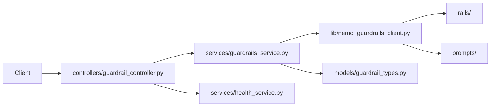

# Guardrails Service

## Overview

`guardrails` is a FastAPI service that will validate inbound listing text and outbound AI-generated property reports. Phase 1 establishes the service skeleton, centralized configuration, and stable API contracts so the NeMo Guardrails runtime can be added cleanly in Phase 2.

## Architecture Diagram



Design notes:
- Controllers stay thin and only translate HTTP traffic into service calls.
- Service methods own response-contract mapping.
- The NeMo wrapper is isolated in `lib/` so policy runtime details stay out of controllers.

## Setup Instructions

### Local Development

1. Create a virtual environment.
2. Install dependencies with `pip install -r requirements.txt`.
3. Copy `.env.example` to `.env` and adjust values as needed.
4. Run `uvicorn app:app --reload --host 0.0.0.0 --port 8010`.

### Docker Deployment

1. Copy `.env.example` to `.env`.
2. Run `docker compose up --build`.
3. Check `http://localhost:8010/health`.

## API Documentation

### `POST /check/input`

Request:

```json
{ "text": "3-bedroom apartment in Haifa with balcony and sea view." }
```

Response:

```json
{ "pass": true, "reason": "", "safe_text": "" }
```

### `POST /check/output`

Request:

```json
{ "text": "Draft property report text" }
```

Response:

```json
{ "pass": true, "reason": "", "safe_text": "Draft property report text" }
```

### `GET /health`

Returns readiness information for config and the future runtime wrapper.

## Configuration

All environment variables are loaded only in `config.py`.

- `APP_HOST` / `APP_PORT`: FastAPI bind settings.
- `LOG_LEVEL`: Python logging level.
- `NEMO_MODEL_PROVIDER` / `NEMO_MODEL_NAME`: Future NeMo LLM provider settings.
- `NEMO_API_KEY`: Provider API key. For your setup, this should contain the Gemini API key.
- `INPUT_RAILS_DIR` / `OUTPUT_RAILS_DIR`: Rail config directories.
- `PROMPT_TEST_FILE` / `PROMPT_LOG_FILE`: Prompt-engineering artifact paths.
- `INPUT_STRICT_MODE` / `OUTPUT_STRICT_MODE`: Optional strictness toggles.

## Development

- Run tests with `pytest tests`.
- Phase 1 includes contract coverage in `tests/test_contracts.py`.
- Prompt-engineering artifacts will be expanded in Phase 3.

## Deployment

- Base image: `python:3.11-slim`
- Default service port: `8010`
- Runtime user: non-root `appuser`
- Health endpoint: `/health`
- Logs: stdout/stderr via standard FastAPI/Uvicorn logging
- Suitable for EC2 packaging once Phase 2-5 runtime and docs are completed
