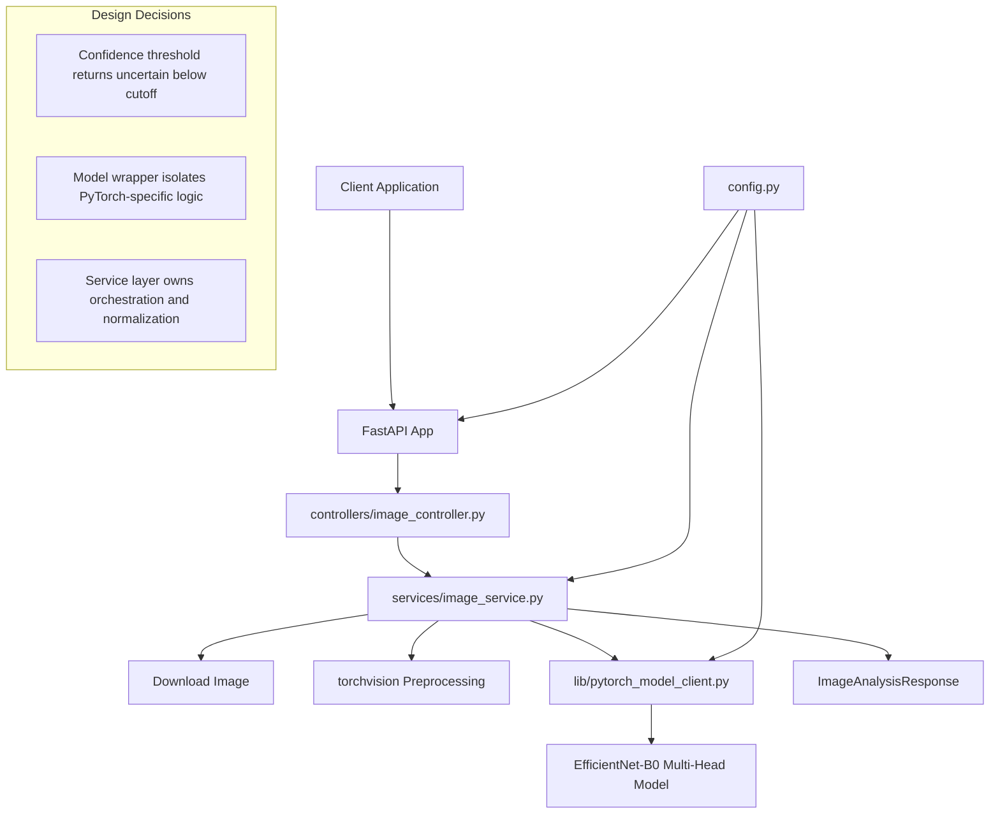

# Image Analyzer Service

## Overview

`imageAnalyzer` is a FastAPI service for analyzing property photos. It downloads an image from a URL, preprocesses it for an EfficientNet-B0 based PyTorch model, predicts the room type, and returns a normalized condition score from 1 to 5. If the model confidence is below the configured threshold, the service returns `uncertain` and omits the condition score.

Stack:
- FastAPI for the HTTP API
- PyTorch, torchvision, and timm for model inference
- Pillow for image handling
- Docker and Docker Compose for AWS EC2 deployment

Minimum deployment target:
- AWS EC2 `t3.small` or larger
- Recommended minimum RAM: 2 GB for API-only runtime, more when training or loading larger checkpoints

## Architecture Diagram



Design decisions:
- The controller only handles HTTP concerns and delegates inference work to the service layer.
- `config.py` is the single source of truth for environment variables.
- The model client encapsulates low-level PyTorch model setup and prediction formatting.

## Setup Instructions

### Local Development

1. Create and activate a virtual environment.
2. Install dependencies:

```bash
pip install -r requirements.txt
```

3. Create a local environment file:

```bash
cp .env.example .env
```

4. Start the API:

```bash
uvicorn app:app --host 0.0.0.0 --port 8000 --reload
```

### Docker Deployment

1. Create `.env` from `.env.example`.
2. Build and start the service:

```bash
docker compose up --build
```

3. Verify service health:

```bash
curl http://localhost:8000/health
```

Mount points:
- `/app/data/raw`
- `/app/data/processed`
- `/app/models`

Logs are written to stdout and stderr, which is suitable for Docker logging drivers and CloudWatch collection on EC2.

## API Documentation

### `GET /health`

Returns a basic liveness response.

Example response:

```json
{
  "status": "ok"
}
```

### `POST /analyse`

Request body:

```json
{
  "image_url": "https://example.com/property-room.jpg"
}
```

Successful response:

```json
{
  "room_type": "kitchen",
  "condition_score": 4,
  "confidence": 0.91
}
```

Low-confidence response:

```json
{
  "room_type": "uncertain",
  "condition_score": null,
  "confidence": 0.61
}
```

## Configuration

Environment variables are loaded in [config.py](/d:/aiPycharm/aiPropertyTriangeProject/imageAnalyzer/config.py).

Important settings:
- `APP_NAME`: FastAPI application title
- `APP_HOST`: Bind host for Uvicorn
- `APP_PORT`: Service port
- `APP_ENV`: Runtime environment label
- `APP_RELOAD`: Enables local auto-reload when set to `true`
- `LOG_LEVEL`: Logging verbosity
- `MODEL_PATH`: Path to the trained model checkpoint
- `MODEL_DIR`: Directory that stores model artifacts
- `CONFIDENCE_THRESHOLD`: Cutoff below which the API returns `uncertain`
- `RAW_DATA_DIR`: Raw dataset directory
- `PROCESSED_DATA_DIR`: Processed dataset directory
- `KAGGLE_DATASET`: Dataset source identifier

See [.env.example](/d:/aiPycharm/aiPropertyTriangeProject/imageAnalyzer/.env.example) for the template used by Docker Compose and local development.

## Development

### Model Training (Transfer Learning)

The training pipeline in `scripts/train_model.py` uses a pre-trained EfficientNet-B0 backbone with frozen convolutional layers and two trainable heads:

- Classification head for room type (`kitchen`, `bathroom`, `living room`, `bedroom`, `other`)
- Regression head for condition score (`1` to `5`)

Expected dataset inputs:

- At least `200` labeled images total across `train`, `val`, and `test` splits
- A CSV file at `data/raw/labels.csv` by default (or pass `--labels-csv`)
- Images stored under `data/raw` by default (or pass `--images-root`)

CSV schema:

```csv
image_path,room_type,condition_score,split
train/kitchen/img_001.jpg,kitchen,4,train
val/bathroom/img_010.jpg,bathroom,3,val
test/other/img_120.jpg,other,5,test
```

Data augmentation strategy used during training:

- `RandomResizedCrop(224, scale=(0.7, 1.0))`
- `RandomHorizontalFlip(0.5)`
- `RandomRotation(12)`
- `ColorJitter(brightness=0.2, contrast=0.2, saturation=0.2)`
- ImageNet normalization

Run training:

```bash
python scripts/train_model.py --labels-csv data/raw/labels.csv --images-root data/raw
```

Outputs:

- Best checkpoint: `models/efficientnet_multihead_best.pt`
- Metrics report (includes final test accuracy): `models/training_metrics.json`

Run tests:

```bash
pytest tests -q
```

Run a syntax check:

```bash
python -m compileall .
```

Recommended next improvements:
- Add integration tests that exercise a real checkpoint file
- Add structured request logging middleware
- Add CI validation for Docker build and pytest execution

## Deployment

EC2 deployment notes:
- Build on `t3.small` or larger as planned
- Exposed container port: `8000`
- Health endpoint: `GET /health`
- Persistent volumes: raw data, processed data, model artifacts
- Restart policy: `on-failure`
- Network isolation: dedicated bridge network in `docker-compose.yml`

Example EC2 deployment flow:

```bash
cp .env.example .env
docker compose up --build -d
curl http://localhost:8000/health
```
