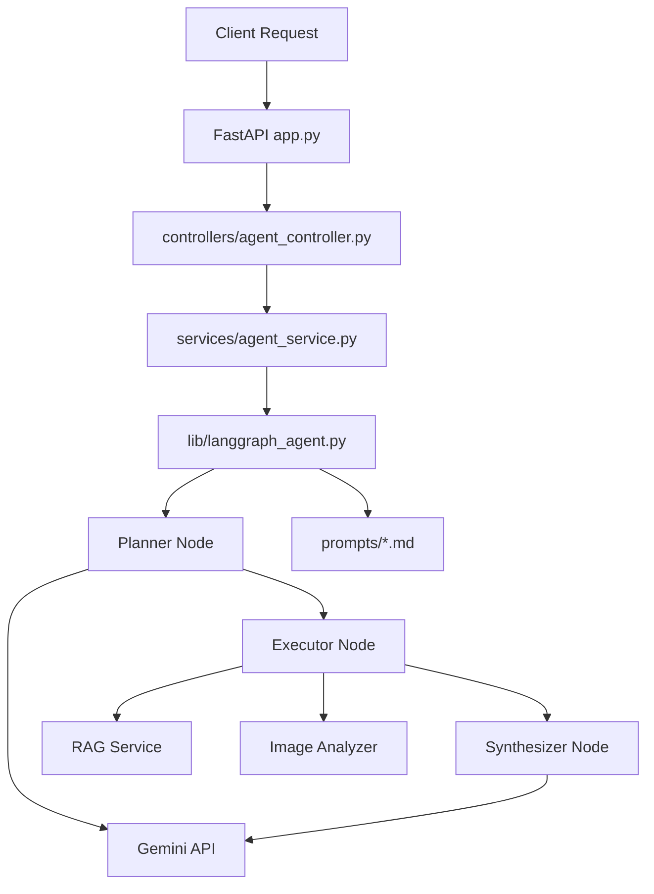

# LangGraph Agent Service

## Overview

This service exposes `POST /agent/run` for complex property questions. It uses a three-step agent flow:

1. Planner: selects `rag_search`, `image_analysis`, or both.
2. Executor: calls the external services and captures structured results or failures.
3. Synthesizer: produces a final answer with fallback behavior when external dependencies are unavailable.

The service is intentionally structured so the HTTP layer stays thin, configuration stays centralized in `config.py`, and prompt-engineering assets stay reproducible through the benchmark harness.

## Architecture



Design decisions:
- Controllers only translate HTTP concerns and service exceptions.
- `AgentService` owns validation, timeout checks, and response shaping.
- `PropertyAgent` owns state transitions, tool routing, and synthesis logic.
- External dependencies are wrapped in `utils/external_apis.py` and `utils/gemini_handler.py`.
- Prompt surfaces are versioned by generated markdown files so prompt tuning is inspectable.

## Project Structure

```text
langGraphAgent/
|-- controllers/
|-- docs/
|-- lib/
|-- models/
|-- prompts/
|-- services/
|-- tests/
|-- utils/
|-- app.py
|-- config.py
|-- Dockerfile
|-- docker-compose.yml
|-- README.md
`-- requirements.txt
```

Key files:
- `app.py`: FastAPI entrypoint and root health metadata
- `controllers/agent_controller.py`: `POST /agent/run`
- `services/agent_service.py`: validation, timeout enforcement, response mapping
- `lib/langgraph_agent.py`: planner, executor, synthesizer, prompt surfaces, typed state
- `utils/external_apis.py`: RAG and image-analyzer clients
- `utils/gemini_handler.py`: Gemini wrapper with retries and logging
- `tests/agent_benchmark.py`: prompt benchmark and iteration log generator

## API

### POST `/agent/run`

Request:

```json
{
  "query": "What renovation work would be needed to bring this property to a condition score of 5?"
}
```

Response:

```json
{
  "answer": "This request likely needs both listing retrieval and photo analysis. Use listing data for facts and comparisons, then use images for visible condition findings before giving a final recommendation.",
  "tools_used": ["rag_search", "image_analysis"],
  "reasoning_steps": [
    {
      "step_number": 1,
      "description": "Planner selected tools using the optimized tool-selection surface.",
      "tool_used": null
    },
    {
      "step_number": 2,
      "description": "Executed rag_search and captured structured results.",
      "tool_used": "rag_search"
    }
  ],
  "execution_time_ms": 12.5
}
```

Behavior notes:
- Empty queries return `400`
- Queries exceeding the service limit return `400`
- Timeout failures return `504`
- Unexpected runtime failures return `500`

### GET `/`

Returns:

```json
{
  "service": "LangGraph Agent",
  "status": "ready",
  "agent_endpoint": "/agent/run"
}
```

## Configuration

All environment variables are loaded once in `config.py`.

Required or supported variables:
- `GEMINI_API_KEY`: Gemini API key used by `GeminiClient`
- `RAG_SERVICE_URL`: base URL for the RAG API
- `IMAGE_ANALYZER_URL`: base URL for the image-analysis API
- `AGENT_TIMEOUT_SECONDS`: request timeout in seconds, default `30`
- `AGENT_LOG_LEVEL`: runtime log verbosity, default `INFO`

Example bootstrap:

```powershell
copy .env.example .env
```

## Prompt Engineering

The service includes a full phase-3 prompt-optimization workflow.

Surfaces:
1. Tool selection
2. Retrieval query shaping
3. Image-analysis interpretation
4. Multi-source synthesis
5. Error recovery

Artifacts:
- `prompts/iteration_surface_1_v1.md` through `prompts/iteration_surface_5_v5.md`
- `prompts/tool_descriptions_final.md`

Final benchmark outcome:
- Surface 1: `10/10`
- Surface 2: `10/10`
- Surface 3: `10/10`
- Surface 4: `10/10`
- Surface 5: `10/10`

## Testing

Runtime tests:
- `tests/test_agent_service.py`: service validation and timing
- `tests/test_agent_nodes.py`: planner, executor, synthesizer, and reasoning-step behavior
- `tests/test_agent_endpoints.py`: route registration and controller behavior
- `tests/test_agent_integration.py`: end-to-end service/controller flow and failure handling

Benchmark tests:
- `tests/agent_benchmark.py`: deterministic benchmark generator for all 5 prompt surfaces

Commands:

```powershell
python tests/agent_benchmark.py
python -m unittest discover -s tests -p "test_*.py"
```

Current validation status:
- Benchmark surfaces: `5/5` passing at `100%`
- Runtime test suite: `17` tests passing

## Local Development

```powershell
python -m venv .venv
.venv\Scripts\Activate.ps1
pip install -r requirements.txt
copy .env.example .env
uvicorn app:app --reload --port 8010
```

## Docker Deployment

### Files

- `Dockerfile`: Python 3.11 slim image, pinned dependencies, non-root user, port `8010`
- `docker-compose.yml`: local compose setup with `.env`, port mapping, restart policy, and isolated network

### Start

```powershell
copy .env.example .env
docker compose up --build
```

### Deployment Notes

- Recommended host: AWS EC2 `t3.small` or larger
- Minimum expected RAM for this service: about `2 GB`
- Health endpoint: `GET /`
- Logs are emitted to stdout/stderr for CloudWatch-friendly collection
- Compose mount points:
  - `./prompts -> /app/prompts`
  - `./tests -> /app/tests`

## Extension Guide

To add a new tool:
1. Add its description to `TOOL_DESCRIPTIONS` in `lib/langgraph_agent.py`.
2. Extend planner logic so the tool can be selected intentionally.
3. Add executor handling and a structured result shape.
4. Add benchmark cases in `tests/agent_benchmark.py`.
5. Add unit and integration coverage in `tests/test_agent_*.py`.

To modify prompts:
1. Update the relevant surface text in `lib/langgraph_agent.py`.
2. Re-run `python tests/agent_benchmark.py`.
3. Inspect the generated `prompts/iteration_surface_*` files.
4. Confirm `prompts/tool_descriptions_final.md` still reflects the final wording.

## Debugging

- If tool selection is wrong, start in `_planner_node()` and `_heuristic_tool_selection()`.
- If external calls fail, inspect `utils/external_apis.py` and `utils/gemini_handler.py`.
- If HTTP behavior is wrong, inspect `controllers/agent_controller.py` and `services/agent_service.py`.
- If benchmark scores regress, compare current prompt surfaces with the generated prompt iteration logs.

## Status Against Plan

Completed:
- Endpoint, models, config, service, and router
- Three-node agent flow with typed state
- External client wrappers and Gemini wrapper
- Prompt benchmark infrastructure with 25 generated iteration files
- Unit, integration, and endpoint tests
- Docker, compose, env template, and pinned requirements

Remaining external verification:
- Docker build and container startup have not been executed in this workspace session
- Real Gemini/RAG/Image Analyzer integration still depends on valid external services and credentials
