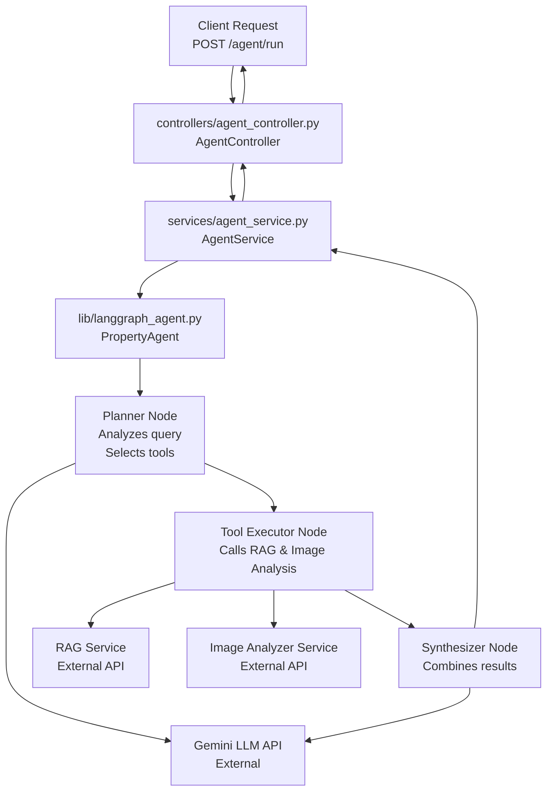

# Plan: LangGraph Agent for Complex Property Queries

## TL;DR

Build a stateful LangGraph agent with three nodes (planner, tool executor, synthesizer) that answers complex multi-step questions about property listings. The agent uses an external Gemini LLM API and orchestrates calls to the RAG service and Image Analyzer. Integrate with FastAPI via `POST /agent/run` endpoint. Conduct structured prompt engineering to optimize tool descriptions across 5 surfaces (one per tool/task combination), 5 iterations each, with documented failure analysis.

---

## Public Interface

### POST /agent/run

**Request:**

```json
{
  "query": "<complex question about the listing>"
}
```

Example queries:

- "What renovation work would be needed to bring this property to a condition score of 5?"
- "Which rooms in the uploaded images need attention?"
- "Compare the condition scores across different areas of the property"

**Response:**

```json
{
  "answer": "<synthesized final answer>",
  "tools_used": ["rag_search", "image_analysis"],
  "reasoning_steps": [
    "Step 1: Analyzed query to identify needed tools",
    "Step 2: Retrieved property listings from RAG service",
    "Step 3: Analyzed property images for condition scoring",
    "Step 4: Synthesized insights from multiple sources"
  ],
  "execution_time_ms": 2340
}
```

---

## Architecture Overview



---

## Phases

### **Phase 1: Project Skeleton & Core Contracts**

**Goal:** Establish the FastAPI endpoint, data models, and service structure for the agent. Ensure all configuration and dependency injection points are in place before implementing the stateful LangGraph logic.

**Implementation Tasks:**

1. Create Pydantic models in `models/agent_types.py`:
   - `AgentQuery` — Request model with `query: str` field
   - `ReasoningStep` — Intermediate reasoning step with `step_number: int`, `description: str`, `tool_used: Optional[str]`
   - `AgentResponse` — Response model with `answer: str`, `tools_used: List[str]`, `reasoning_steps: List[ReasoningStep]`, `execution_time_ms: float`
   - `ToolDescription` — Internal model for tool metadata with `name: str`, `description: str`, `input_schema: Dict`, `output_schema: Dict`

2. Create controller in `controllers/agent_controller.py`:
   - FastAPI `APIRouter` with route: `POST /agent/run`
   - Accept `AgentQuery` and return `AgentResponse`
   - Delegate to `AgentService` for business logic
   - Include error handling for service timeouts and invalid inputs
   - Include docstrings for each endpoint

3. Create service in `services/agent_service.py`:
   - Static class `AgentService` with class method `run_agent(query: str) -> AgentResponse`
   - Instantiate and call `PropertyAgent` from `lib/langgraph_agent.py`
   - Transform LangGraph output into `AgentResponse` contract
   - Handle errors and timeouts (agent should timeout after 30 seconds)
   - Measure and report execution time

4. **[RULE] Envs**: Extend `config.py` with new agent-related environment variables:
   - `GEMINI_API_KEY` — API key for external Gemini LLM API
   - `RAG_SERVICE_URL` — Base URL for RAG service (e.g., `http://localhost:8000`)
   - `IMAGE_ANALYZER_URL` — Base URL for Image Analyzer service (e.g., `http://localhost:8001`)
   - `AGENT_TIMEOUT_SECONDS` — Timeout for agent execution (default: 30)
   - `AGENT_LOG_LEVEL` — Logging verbosity for agent internals (default: "INFO")

5. Create `.env.example` entries for all new variables

6. Update `app.py` to register the new agent router:
   - Add: `from controllers.agent_controller import router as agent_router`
   - Add: `app.include_router(agent_router)`

7. **[RULE] Libs**: Create skeleton `lib/langgraph_agent.py`:
   - Class `PropertyAgent` with three attributes:
     - `_planner_node` — Will implement query analysis
     - `_executor_node` — Will implement tool calling
     - `_synthesizer_node` — Will implement result synthesis
   - Stub methods for each node (return minimal valid output for now)
   - Method: `invoke(query: str) -> Dict` — Entry point for the agent
   - Include logging for all state transitions

**Review Checklist:**

- [ ] Pydantic models in `models/agent_types.py` match response contract
- [ ] `POST /agent/run` endpoint registered and returns `AgentResponse` schema
- [ ] `AgentService.run_agent()` exists and is callable from controller
- [ ] `Config` class has all new agent environment variables
- [ ] `.env.example` documents all new variables with descriptions
- [ ] `PropertyAgent` skeleton exists in `lib/langgraph_agent.py`
- [ ] Local test: `curl -X POST http://localhost:8010/agent/run -H "Content-Type: application/json" -d '{"query":"test"}' ` returns valid JSON response

---

### **Phase 2: LangGraph Agent Architecture & Node Implementation**

**Goal:** Implement the three-node LangGraph agent with state management, node logic, and tool composition. The agent should be testable independently before prompt engineering.

**Implementation Tasks:**

1. **[RULE] Libs**: Enhance `lib/langgraph_agent.py`:
   - Define LangGraph state schema (using `TypedDict`):
     - `query: str` — Original user query
     - `reasoning_steps: List[Dict]` — Accumulated reasoning
     - `selected_tools: List[str]` — Tools identified by planner
     - `tool_results: Dict[str, Any]` — Results from tool executor
     - `final_answer: str` — Output from synthesizer
   - Implement `_planner_node(state)`:
     - Input: current state with query
     - Call Gemini API with a prompt: "Given this query about property listings, which tools would you use? [rag_search, image_analysis]"
     - Parse response to extract tool selections (should be robust to variations)
     - Update state with `selected_tools` and add reasoning step
     - Return updated state
   - Implement `_executor_node(state)`:
     - Input: state with selected_tools
     - For each tool in `selected_tools`:
       - If `rag_search`: call RAG service with query
       - If `image_analysis`: call Image Analyzer service with query (URL or image_id)
     - Collect results in `tool_results` dict
     - Add reasoning step for each tool call
     - Return updated state
   - Implement `_synthesizer_node(state)`:
     - Input: state with tool_results
     - Call Gemini API with prompt: "Synthesize these findings into a final answer: {tool_results}"
     - Extract final answer
     - Add final reasoning step
     - Return updated state with `final_answer`
   - Build LangGraph `StateGraph`:
     - Add three nodes: planner → executor → synthesizer
     - Set entry point to planner
     - Set end node to synthesizer
   - Implement `invoke(query: str) -> Dict`:
     - Initialize state with query
     - Run graph with timeout (from Config.AGENT_TIMEOUT_SECONDS)
     - Return final state dict

2. Create HTTP client helpers in `utils/external_apis.py`:
   - `class RAGClient`:
     - Method: `search(query: str, top_k: int = 3) -> List[Dict]`
     - Calls `POST {Config.RAG_SERVICE_URL}/search` with query
     - Returns list of results with fields: `id`, `text`, `metadata`
   - `class ImageAnalyzerClient`:
     - Method: `analyze(image_url: str) -> Dict`
     - Calls `POST {Config.IMAGE_ANALYZER_URL}/analyse` with image_url
     - Returns dict with fields: `room_type`, `condition_score`, `confidence`

3. Create Gemini API wrapper in `utils/gemini_handler.py`:
   - `class GeminiClient`:
     - Constructor: `__init__(api_key: str)`
     - Method: `call(prompt: str, temperature: float = 0.7) -> str`
     - Calls external Gemini API with authentication
     - Includes retry logic (up to 3 attempts) on rate limit
     - Logs all API calls and responses at DEBUG level
     - Raises `GeminiAPIError` on failure

4. **[RULE] Envs**: Ensure Config is imported and used in all new utilities:
   - No hardcoded API endpoints or keys
   - All configuration via Config class attributes

5. Add comprehensive logging to all agent operations:
   - Log node entry/exit with timing
   - Log tool selections and results at INFO level
   - Log full prompts and API responses at DEBUG level

**Review Checklist:**

- [ ] LangGraph state schema defined with all required fields
- [ ] Planner node correctly identifies tools (test with 5+ manual queries)
- [ ] Executor node successfully calls RAG and Image Analyzer services
- [ ] Synthesizer node produces coherent final answer
- [ ] Agent graph compiles and executes without errors
- [ ] `RAGClient` and `ImageAnalyzerClient` wrappers work with real services
- [ ] `GeminiClient` successfully calls Gemini API
- [ ] Agent execution completes within timeout (Config.AGENT_TIMEOUT_SECONDS)
- [ ] All agent operations are logged for debugging
- [ ] Local test with sample query returns valid response

---

### **Phase 3: Tool Descriptions & Prompt Optimization (5 Surfaces)**

**Goal:** Engineer precise tool descriptions that guide the LangGraph agent to select appropriate tools and use them correctly. Conduct structured prompt engineering with 5 surfaces and 5 iterations per surface, documenting all results.

**Key Insight:** The agent's tool selection depends entirely on the clarity and precision of tool descriptions. Vague descriptions cause wrong tool selections or missed opportunities.

**Implementation Tasks:**

1. Define the 5 surfaces (prompt engineering tasks):
   - **Surface 1**: Tool selection in planner node (Which tool to use?)
   - **Surface 2**: Query interpretation for RAG (How to phrase search queries?)
   - **Surface 3**: Image analysis interpretation (How to interpret condition scores?)
   - **Surface 4**: Result synthesis (How to combine multi-source insights?)
   - **Surface 5**: Error recovery (How to handle missing or conflicting data?)

2. Define the benchmark test suite (10 queries minimum per surface):
   - Query 1: "What is the condition of the kitchen?"
   - Query 2: "How many bedrooms does the listing have?"
   - Query 3: "What renovation is needed to improve condition?"
   - Query 4: "Compare two properties by location and price"
   - Query 5: "Identify rooms that need attention based on images"
   - Query 6: "What is the estimated cost to bring property to 5-star condition?"
   - Query 7: "Which property has the best value in Haifa?"
   - Query 8: "Are there any structural issues visible in the photos?"
   - Query 9: "How does this property compare to market average?"
   - Query 10: "What upgrades would increase property value most?"

3. Create test suite infrastructure in `tests/agent_benchmark.py`:
   - Class `BenchmarkTest` with fields:
     - `test_id: str` (e.g., "S1_T1")
     - `query: str`
     - `expected_tools: List[str]` (expected tool usage)
     - `assertion_keywords: List[str]` (strings that should appear in answer)
     - `expected_reasoning_length: int` (min reasoning steps expected)
   - Function `run_benchmark_suite(surface_id: int) -> BenchmarkResult`:
     - Runs all 10 tests for given surface
     - Returns pass count, failure details, execution times
     - Saves detailed results to `prompts/iteration_surface_{surface_id}_v{iteration}.md`

4. **Iteration Protocol** (repeat for each surface, 5 times):

   **Version 1 — Baseline:**
   - Write tool descriptions without overthinking
   - Run complete test suite (10 tests)
   - Record all outputs, pass rate, failure patterns
   - Document in: `prompts/iteration_surface_X_v1.md`
   - Example format:

     ```markdown
     # Surface X — Iteration 1 (Baseline)

     ## Tool Description

     [Include exact prompt text here]

     ## Test Results

     - Pass Rate: 7/10 (70%)
     - Passing Tests: [list IDs]
     - Failing Tests: [list IDs with failure reasons]

     ## Failure Analysis

     - Primary failure mode: [describe]
     - Secondary patterns: [list]
     ```

   **Versions 2–5 — Targeted Iterations:**
   - Analyze previous results; identify single most critical failure mode
   - Modify tool description to directly address that failure
   - Rerun complete test suite
   - Document in: `prompts/iteration_surface_X_v2.md` ... `_v5.md`
   - By v5, articulate what works reliably and what doesn't

5. Create detailed iteration logs in `prompts/`:
   - `prompts/iteration_surface_1_v1.md` through `_v5.md`
   - `prompts/iteration_surface_2_v1.md` through `_v5.md`
   - ... (repeat for all 5 surfaces)
   - Each log file includes:
     - Exact tool description used
     - Test results (pass/fail with reasons)
     - Failure analysis
     - Next iteration plan

6. Create final consolidated document:
   - `prompts/tool_descriptions_final.md`:
     - Final tool description for each surface
     - Justification for each design decision
     - Final pass rate for each surface (minimum ≥80%, 8/10 tests)
     - Recommendations for future refinement

7. Update `lib/langgraph_agent.py` with optimized tool descriptions:
   - Use final descriptions from prompt engineering
   - Tool descriptions should be constants in `lib/langgraph_agent.py`
   - Example:
     ```python
     TOOL_DESCRIPTIONS = {
         "rag_search": "Search a database of property listings. Use when you need to find similar properties, compare prices, or look up property details like bedrooms, bathrooms, condition scores...",
         "image_analysis": "Analyze photos of a property to identify room types and assess condition. Use when you need to determine what rooms are visible, evaluate their state, or identify areas needing renovation...",
     }
     ```

**Review Checklist:**

- [ ] All 5 surfaces have 10+ test cases defined
- [ ] Each test case includes assertion keywords and expected behaviors
- [ ] Benchmark test infrastructure in `tests/agent_benchmark.py` is functional
- [ ] All 5 surfaces completed 5 iterations each (25 iteration files)
- [ ] Each iteration file documents test results and failure analysis
- [ ] Surface 1 final pass rate ≥80% (8/10)
- [ ] Surface 2 final pass rate ≥80%
- [ ] Surface 3 final pass rate ≥80%
- [ ] Surface 4 final pass rate ≥80%
- [ ] Surface 5 final pass rate ≥80%
- [ ] `prompts/tool_descriptions_final.md` includes justified decisions
- [ ] Tool descriptions updated in `lib/langgraph_agent.py`

---

### **Phase 4: Integration Testing & Validation**

**Goal:** Verify the agent works end-to-end with real external services and handles edge cases gracefully.

**Implementation Tasks:**

1. Create integration tests in `tests/test_agent_integration.py`:
   - Test 1: Agent successfully completes happy path (query → planner → executor → synthesizer → answer)
   - Test 2: Agent handles missing RAG service gracefully (fallback or error message)
   - Test 3: Agent handles missing Image Analyzer gracefully
   - Test 4: Agent handles Gemini API rate limiting (retry logic)
   - Test 5: Agent respects timeout (completes in < Config.AGENT_TIMEOUT_SECONDS)
   - Test 6: Agent produces valid `AgentResponse` schema for all queries
   - Test 7: Agent includes all used tools in `tools_used` list
   - Test 8: Agent provides coherent reasoning steps (at least 3)

2. Create unit tests in `tests/test_agent_service.py`:
   - Test AgentService.run_agent() returns AgentResponse
   - Test execution_time_ms is recorded accurately
   - Test error handling for invalid queries (empty, too long, etc.)

3. Create unit tests in `tests/test_agent_nodes.py`:
   - Test planner node correctly parses Gemini output
   - Test executor node handles missing tool results
   - Test synthesizer node combines results without losing information
   - Test state transitions are logged correctly

4. Create smoke test in `tests/test_agent_endpoints.py`:
   - Test `POST /agent/run` returns 200 OK
   - Test response schema matches `AgentResponse`
   - Test with sample queries from benchmark suite

5. Create `tests/README.md` documenting:
   - How to run tests locally
   - How to run benchmark suite
   - Expected pass rates
   - How to add new test cases

**Review Checklist:**

- [ ] All integration tests pass (8/8)
- [ ] All unit tests pass
- [ ] All smoke tests pass
- [ ] Timeout handling verified (agent completes in time)
- [ ] Error messages are user-friendly and informative
- [ ] `tests/README.md` complete with instructions

---

### **Phase 5: Deployment & Documentation**

**Goal:** Ensure the service is production-ready and well-documented.

**Implementation Tasks:**

1. Update `requirements.txt` with new dependencies:
   - `langgraph==0.x.x` (pinned version)
   - `langchain==0.x.x` (pinned version)
   - `google-generativeai` (Gemini API client)
   - Any other new dependencies with pinned versions
   - Keep grouped comments for clarity

2. Update `Dockerfile`:
   - Ensure all new dependencies are installed from requirements.txt
   - No changes to base image or build strategy unless necessary
   - Include health check comment for reference

3. Update `docker-compose.yml`:
   - Expose port 8010 for guardrails service (if not already exposed)
   - Add environment variables from `.env` for agent configuration
   - Ensure proper restart policy

4. Update `.env.example` with all new variables:
   - `GEMINI_API_KEY` (with description)
   - `RAG_SERVICE_URL` (with description)
   - `IMAGE_ANALYZER_URL` (with description)
   - `AGENT_TIMEOUT_SECONDS` (with description)
   - `AGENT_LOG_LEVEL` (with description)

5. Update main `README.md`:
   - Add "LangGraph Agent" section describing the new feature
   - Document the `POST /agent/run` endpoint with example request/response
   - Update architecture diagram to include agent flow
   - Add note about required external services (RAG, Image Analyzer)
   - Add performance expectations (typical response time, timeout)

6. Create `docs/AGENT_ARCHITECTURE.md`:
   - Detailed explanation of the three-node architecture
   - How to extend with new tools
   - How to modify prompts for different use cases
   - Debugging guide (how to interpret logs)

7. Add agent endpoints to root GET / response:
   - Update `app.py` root endpoint to include `/agent/run`

**Review Checklist:**

- [ ] `requirements.txt` updated with all new dependencies (pinned versions)
- [ ] `Dockerfile` builds successfully with new dependencies
- [ ] `docker-compose.yml` includes all environment variables
- [ ] `.env.example` has descriptions for all new variables
- [ ] Main `README.md` documents agent endpoint and examples
- [ ] `docs/AGENT_ARCHITECTURE.md` provides comprehensive guide
- [ ] Local Docker build completes without errors
- [ ] Docker container starts and health check passes
- [ ] `POST /agent/run` endpoint accessible and working in Docker

---

## Assumptions & Defaults

- **Gemini LLM**: External API calls use Google's Gemini LLM (requires API key)
- **RAG Service**: Assumed running on `http://localhost:8000` (configurable)
- **Image Analyzer**: Assumed running on `http://localhost:8001` (configurable)
- **Timeout**: Agent should complete within 30 seconds (configurable)
- **Logging**: All agent operations logged at INFO level; prompts/responses at DEBUG
- **Tool Descriptions**: Static descriptions stored in `lib/langgraph_agent.py`; can be extended to load from external files
- **State Persistence**: Agent state not persisted between requests (stateless per-request)
- **Error Handling**: Failed tool calls are captured and returned in response (no hard failure)
- **Testing**: Benchmark suite runs against real services (integration tests); requires services to be running
- **Prompt Engineering**: Focus on clarity of tool descriptions; tool names should be machine-readable

---

## Expected Deliverables

1. **Code**:
   - `models/agent_types.py` — Pydantic models
   - `controllers/agent_controller.py` — FastAPI endpoint
   - `services/agent_service.py` — Business logic
   - `lib/langgraph_agent.py` — LangGraph implementation
   - `utils/external_apis.py` — RAG and Image Analyzer clients
   - `utils/gemini_handler.py` — Gemini API wrapper
   - `tests/agent_benchmark.py` — Benchmark test infrastructure
   - `tests/test_agent_*.py` — Unit and integration tests

2. **Documentation**:
   - Updated `README.md` with agent endpoint
   - `prompts/iteration_surface_*_v*.md` — 25 iteration logs
   - `prompts/tool_descriptions_final.md` — Final prompt decisions
   - `docs/AGENT_ARCHITECTURE.md` — Architecture deep dive
   - `tests/README.md` — Testing guide

3. **Configuration**:
   - Extended `config.py` with agent variables
   - Updated `.env.example` with descriptions
   - Updated `Dockerfile` and `docker-compose.yml`

---

## Success Criteria

- ✅ `POST /agent/run` endpoint works end-to-end
- ✅ Agent successfully uses both RAG and Image Analyzer tools
- ✅ Response matches `AgentResponse` schema (answer, tools_used, reasoning_steps, execution_time_ms)
- ✅ All 5 prompt engineering surfaces achieve ≥80% pass rate (8/10 tests minimum)
- ✅ Agent completes within timeout (≤30 seconds for typical queries)
- ✅ Comprehensive logging enables debugging
- ✅ Docker deployment works without manual setup
- ✅ Documentation enables future extensions (new tools, modified prompts)
