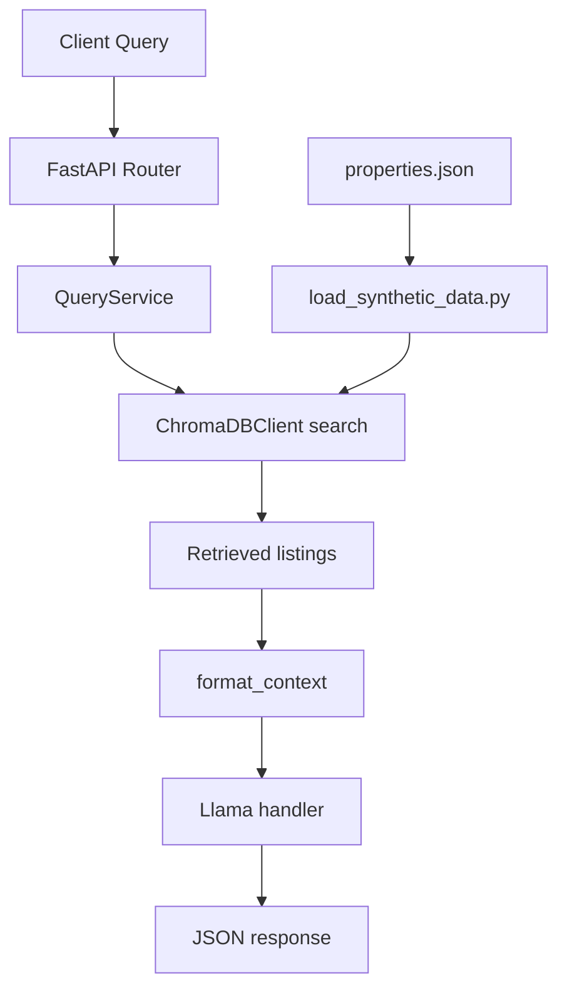

# RAG Property Listing Service

## Overview

This service exposes a FastAPI API for retrieval-augmented property analysis. It searches a persistent ChromaDB collection of synthetic property listings, formats the best matches into prompt context, and generates concise insight text with a Llama.cpp-compatible GGUF model.

Stack:

- FastAPI + Uvicorn
- ChromaDB persistent local vector store
- sentence-transformers `all-MiniLM-L6-v2`
- Llama.cpp via `llama-cpp-python`
- Docker and Docker Compose for EC2-style deployment

## Architecture Diagram



Design decisions:

- `config.py` is the single source of truth for environment variables.
- `lib/chromadb_client.py` abstracts ChromaDB setup, embeddings, and collection operations.
- `controllers/` remain thin and delegate business logic into `services/`.
- Llama initialization is lazy and falls back safely when the model cannot be downloaded or loaded.

## Setup Instructions

### Local Development

1. Create and activate a virtual environment.
2. Install dependencies with `pip install -r requirements.txt`.
3. Copy `.env.example` to `.env`.
4. Load synthetic data with `python data/load_synthetic_data.py`.
5. Run the API with `uvicorn app:app --reload --host 0.0.0.0 --port 8000`.
6. On startup, the service preloads the configured GGUF model so the download does not wait for the first `/query` request.

### Docker Deployment

1. Copy `.env.example` to `.env`.
2. Build and start with `docker-compose up --build`.
3. The container automatically seeds ChromaDB on startup when the collection is empty.
4. The FastAPI startup lifecycle preloads the configured GGUF model into `/app/artifacts/models`.
5. The API becomes available on `http://localhost:8000`.
6. Chroma data persists in `chroma_data` and GGUF models persist in `model_data`.

## API Documentation

### `GET /`

Returns basic service metadata.

```json
{
  "service": "rag-property-listing-service",
  "status": "ready",
  "health_endpoint": "/health",
  "query_endpoint": "/query"
}
```

### `GET /health`

Returns service health and current collection state.

```json
{
  "status": "operational",
  "embedding_model_loaded": true,
  "chroma_db_initialized": true,
  "llama_model_loaded": false,
  "collection_count": 22
}
```

### `POST /query`

Request body:

```json
{
  "description": "Modern 3-bedroom apartment with good condition in Haifa"
}
```

Example response: (took 9 minutes to generate locally)

```json
{
    "similar_listings": [
        {
            "id": "prop_001",
            "price": 2500000,
            "bedrooms": 3,
            "bathrooms": 2.0,
            "rooms": 5,
            "location": "Haifa Downtown",
            "condition": "Good",
            "description": "Beautiful 3-bedroom apartment in Haifa Downtown with modern kitchen and hardwood floors. Close to shopping, dining, and sea views.",
            "distance": 0.2273300653582151
        },
        {
            "id": "prop_004",
            "price": 3200000,
            "bedrooms": 3,
            "bathrooms": 2.5,
            "rooms": 5,
            "location": "Jerusalem Center",
            "condition": "Excellent",
            "description": "Contemporary apartment in Jerusalem Center with city views, open floor plan, and energy-efficient systems.",
            "distance": 0.421129737994125
        },
        {
            "id": "prop_002",
            "price": 3800000,
            "bedrooms": 4,
            "bathrooms": 3.0,
            "rooms": 6,
            "location": "Tel Aviv North",
            "condition": "Excellent",
            "description": "Luxury apartment in Tel Aviv North with panoramic city views, updated amenities, and smart home features.",
            "distance": 0.42452008541576847
        }
    ],
    "insight": "A modern 3-bedroom apartment in good condition is available for purchase in Haifa at property prop_001, priced at 2500000. The location of the property in Haifa Downtown provides easy access to shopping, dining, and sea views."
}
```

## Configuration

Environment variables are loaded only in [config.py](/d:/aiPycharm/aiPropertyTriangeProject/ragService/config.py).

- `LLAMA_MODEL_NAME`: Hugging Face repository for the GGUF model
- `LLAMA_MODEL_FILE`: GGUF filename to download and load
- `LLAMA_N_GPU_LAYERS`: GPU offload setting for llama.cpp
- `CHROMA_DB_PATH`: persistent Chroma data directory
- `CHROMA_COLLECTION_NAME`: collection name for listing vectors
- `CHROMA_ANONYMIZED_TELEMETRY`: enables Chroma usage telemetry when set to `true` (defaults to `false`)
- `EMBEDDING_MODEL`: sentence-transformers model name
- `TOP_K_LISTINGS`: number of similar properties to retrieve
- `SERVER_HOST`: FastAPI bind host
- `SERVER_PORT`: FastAPI bind port
- `LOG_LEVEL`: application logging level

## Development

Useful commands:

- `python -m py_compile app.py config.py controllers/property_controller.py services/health_service.py services/query_service.py middlewares/logging_middleware.py models/property_types.py lib/chromadb_client.py utils/retrieval.py utils/llama_handler.py data/load_synthetic_data.py`
- `python tests/run_prompt_tests.py`
- `pytest tests`

Prompt-engineering artifacts:

- `prompts/final_prompts.py`
- `prompts/ENGINEERING_LOG.md`
- `prompts/iteration_surface_*_v*.md`
- `prompts/iteration_surface_*_final.md`

## Deployment

AWS EC2 readiness notes:

- Recommended instance size: `t3.small` or larger
- Minimum memory guidance: 4 GB RAM, 8 GB preferred for better inference headroom
- Logs go to stdout/stderr for CloudWatch collection
- Health check endpoint: `GET /health`
- Persistent mount targets:
  - ChromaDB: `/app/artifacts/chroma_db`
  - GGUF models: `/app/artifacts/models`

The container runs as a non-root user and exposes port `8000`.
