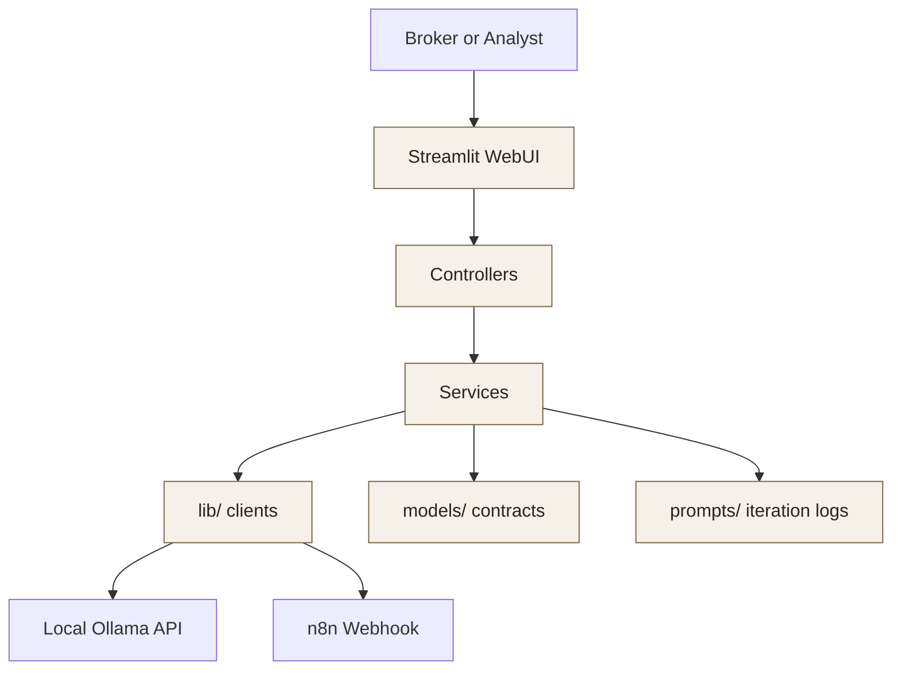

# aiPropertyTriage WebUI

Streamlit-based WebUI for `aiPropertyTriageProject`, designed around a clean service layout and prepared for local Ollama chat, n8n listing submission, prompt iteration, and container deployment.

## Overview

The WebUI service provides two user-facing surfaces:

- A conversational assistant for real-estate-only guidance backed by a local Ollama model.
- A listing submission workflow that sends structured listing data to an n8n webhook and renders the returned triage report.

The WebUI includes a modular project skeleton, centralized configuration, prompt-management artifacts, and production-oriented deployment assets.

## Architecture Diagram



Design decisions:

- `config.py` is the only place that reads environment variables.
- `models/`, `controllers/`, and `services/` separate UI contracts from business logic.
- `lib/` is reserved for external service clients such as Ollama and n8n.
- `prompts/` stores prompt versions and prompt engineering artifacts required by the repo rules.

## Setup Instructions

### Local development

1. Create and activate a Python 3.11 virtual environment.
2. Install dependencies with `pip install -r requirements.txt`.
3. Copy `.env.example` to `.env` and adjust host/port/model/webhook values as needed.
4. Run the UI with `streamlit run app.py --server.address 0.0.0.0 --server.port 8501`.

### Current implementation status

- `app.py` renders both tabs (assistant and listing submission).
- `config.py` centralizes service configuration.
- Core folders exist for models, controllers, services, middlewares, utils, tests, prompts, and `lib`.
- Ollama and n8n integrations are implemented through `lib/` clients and service layers.

## Configuration

All configuration is accessed through `Config` in [config.py](/d:/aiPycharm/aiPropertyTriageProject/webui/config.py).

Current key settings:

- `WEBUI_APP_TITLE`: Streamlit page title.
- `WEBUI_SERVER_PORT`: Streamlit port.
- `WEBUI_REQUEST_TIMEOUT_SECONDS`: Default outbound request timeout.
- `OLLAMA_HOST`, `OLLAMA_PORT`, `OLLAMA_MODEL`, `OLLAMA_CHAT_ENDPOINT`: Ollama connection settings.
- `N8N_WEBHOOK_URL`: Listing submission webhook URL.
- `PROMPT_SURFACE`, `PROMPT_VERSION`: Active prompt selection.

## API / Integration Surface

The following request/response contracts are implemented in the WebUI integration layers.

- Conversational Assistant:
  - Input: chat message
  - Output: model response constrained to real-estate support
- Listing Submission:
  - Input: listing description, image URLs, agent metadata
  - Output: structured n8n report with scores and recommendations

### Listing Submission Request (to n8n)

`POST` to `N8N_WEBHOOK_URL` with JSON body:

```json
{
  "agent_name": "Jane Broker",
  "listing_description": "2 bed condo near downtown with balcony",
  "image_urls": [
    "https://example.com/img-1.jpg",
    "https://example.com/img-2.jpg"
  ]
}
```

### Listing Submission Response (from n8n)

Expected normalized JSON shape:

```json
{
  "summary": "Listing has strong photo quality with one weak angle.",
  "recommendations": [
    "Retake the kitchen photo with brighter lighting",
    "Lead with the balcony image in the hero slot"
  ],
  "image_scores": [
    {
      "image_url": "https://example.com/img-1.jpg",
      "score": 8.7,
      "reason": "Well lit and wide composition"
    }
  ]
}
```

## Development

- Tests live in `tests/`.
- Prompt artifacts live in `prompts/`.
- External integrations must be wrapped in `lib/`.
- Use pinned dependencies in `requirements.txt`.

## Deployment

Deployment assets now included:

- `Dockerfile`
- `docker-compose.yml`
- `.env.example`

### Health Check

- Streamlit health endpoint: `/_stcore/health`
- Local URL example: `http://127.0.0.1:8501/_stcore/health`
- Docker health checks are configured in both `Dockerfile` and `docker-compose.yml`.

### Docker (Local)

1. Copy `.env.example` to `.env` and set values for your environment.
2. Build and start:
   - `docker compose up --build`
3. Open the UI:
   - `http://127.0.0.1:8501`
4. Stop services:
   - `docker compose down`

### AWS EC2 Deployment (Ubuntu)

1. Provision EC2 (recommended `t3.small` or larger).
2. Install Docker Engine + Docker Compose plugin.
3. Clone repo and move to `webui/`.
4. Copy `.env.example` to `.env` and set production values.
5. Start service:
   - `docker compose up --build -d`
6. Validate health:
   - `curl http://127.0.0.1:8501/_stcore/health`
7. Expose port `8501` via security group or place behind a reverse proxy/ALB.

### Memory Footprint (Guideline)

- WebUI container baseline: ~250-400 MB RAM.
- Recommended total with overhead: >=1 GB free RAM for WebUI alone.
- If Ollama and n8n share the same host, size instance memory significantly higher based on model size.

### Volume Mounts

Configured in `docker-compose.yml`:

- `./prompts:/app/prompts` for prompt/version artifacts persistence.
- `./tests:/app/tests` for keeping test files visible in the container.
